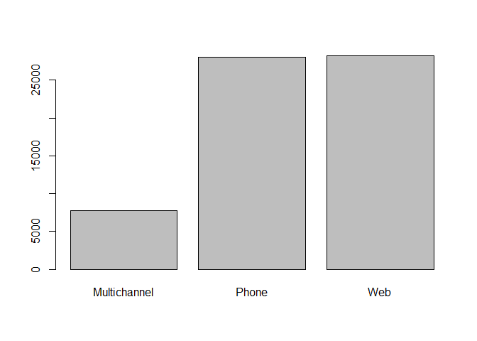
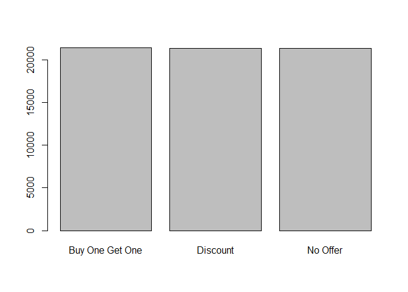
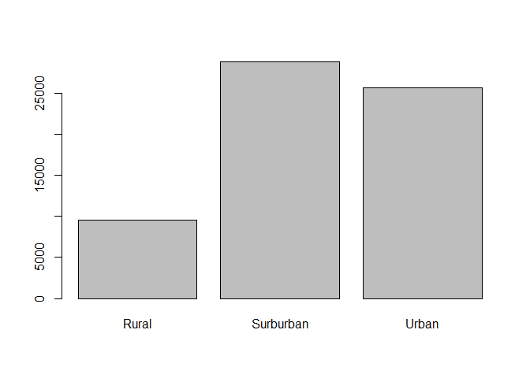

EDA\_of\_Upworthy\_dataset
================
Noah Mott
11/4/2021

``` r
mydata<-read.csv('data.csv')
```

``` r
summary(mydata)
```

    ##     recency          history        used_discount     used_bogo     
    ##  Min.   : 1.000   Min.   :  29.99   Min.   :0.000   Min.   :0.0000  
    ##  1st Qu.: 2.000   1st Qu.:  64.66   1st Qu.:0.000   1st Qu.:0.0000  
    ##  Median : 6.000   Median : 158.11   Median :1.000   Median :1.0000  
    ##  Mean   : 5.764   Mean   : 242.09   Mean   :0.551   Mean   :0.5497  
    ##  3rd Qu.: 9.000   3rd Qu.: 325.66   3rd Qu.:1.000   3rd Qu.:1.0000  
    ##  Max.   :12.000   Max.   :3345.93   Max.   :1.000   Max.   :1.0000  
    ##    zip_code          is_referral       channel             offer          
    ##  Length:64000       Min.   :0.0000   Length:64000       Length:64000      
    ##  Class :character   1st Qu.:0.0000   Class :character   Class :character  
    ##  Mode  :character   Median :1.0000   Mode  :character   Mode  :character  
    ##                     Mean   :0.5022                                        
    ##                     3rd Qu.:1.0000                                        
    ##                     Max.   :1.0000                                        
    ##    conversion    
    ##  Min.   :0.0000  
    ##  1st Qu.:0.0000  
    ##  Median :0.0000  
    ##  Mean   :0.1468  
    ##  3rd Qu.:0.0000  
    ##  Max.   :1.0000

The above is a basic summary of the data in the dataset. You’ll note
that

``` r
library(dplyr)
```

    ## Warning: package 'dplyr' was built under R version 4.0.5

    ## 
    ## Attaching package: 'dplyr'

    ## The following objects are masked from 'package:stats':
    ## 
    ##     filter, lag

    ## The following objects are masked from 'package:base':
    ## 
    ##     intersect, setdiff, setequal, union

``` r
mydata %>%
  select(everything()) %>%  
  summarise_all(funs(sum(is.na(.))))
```

    ## Warning: `funs()` was deprecated in dplyr 0.8.0.
    ## Please use a list of either functions or lambdas: 
    ## 
    ##   # Simple named list: 
    ##   list(mean = mean, median = median)
    ## 
    ##   # Auto named with `tibble::lst()`: 
    ##   tibble::lst(mean, median)
    ## 
    ##   # Using lambdas
    ##   list(~ mean(., trim = .2), ~ median(., na.rm = TRUE))

    ##   recency history used_discount used_bogo zip_code is_referral channel offer
    ## 1       0       0             0         0        0           0       0     0
    ##   conversion
    ## 1          0

All Data in the data frame is filled in. This is a good data set for
exploration

``` r
unique(mydata$zip_code)
```

    ## [1] "Surburban" "Rural"     "Urban"

``` r
unique(mydata$channel)
```

    ## [1] "Phone"        "Web"          "Multichannel"

``` r
plot(as.factor(mydata$channel))
```

<!-- -->

``` r
unique(mydata$offer)
```

    ## [1] "Buy One Get One" "No Offer"        "Discount"

``` r
plot(as.factor(mydata$offer))
```

<!-- --> We can see in
the above unique values that the categorical columns for offer,
zip\_code, and channel each have 3 categories each. In order to
appropriately use them in any sort of regression, we will need to encode
the values 1 through 3.

``` r
plot(as.factor(mydata$zip_code))
```

<!-- -->

``` r
chart1 <- table(as.factor(mydata$zip_code), as.factor(mydata$offer))
chart2<-table(as.factor(mydata$zip_code), as.factor(mydata$channel))
chart3<-table(as.factor(mydata$channel), as.factor(mydata$offer))
```

``` r
chart1
```

    ##            
    ##             Buy One Get One Discount No Offer
    ##   Rural                3181     3243     3139
    ##   Surburban            9650     9501     9625
    ##   Urban                8556     8563     8542

``` r
chart2
```

    ##            
    ##             Multichannel Phone   Web
    ##   Rural             1130  4195  4238
    ##   Surburban         3465 12521 12790
    ##   Urban             3167 11305 11189

``` r
chart3
```

    ##               
    ##                Buy One Get One Discount No Offer
    ##   Multichannel            2579     2577     2606
    ##   Phone                   9454     9240     9327
    ##   Web                     9354     9490     9373

``` r
mydata %>%
        group_by(zip_code) %>%
        tally()
```

    ## # A tibble: 3 x 2
    ##   zip_code      n
    ##   <chr>     <int>
    ## 1 Rural      9563
    ## 2 Surburban 28776
    ## 3 Urban     25661

``` r
mydata %>%
        group_by(offer) %>%
        tally()
```

    ## # A tibble: 3 x 2
    ##   offer               n
    ##   <chr>           <int>
    ## 1 Buy One Get One 21387
    ## 2 Discount        21307
    ## 3 No Offer        21306

``` r
mydata %>%
        group_by(channel) %>%
        tally()
```

    ## # A tibble: 3 x 2
    ##   channel          n
    ##   <chr>        <int>
    ## 1 Multichannel  7762
    ## 2 Phone        28021
    ## 3 Web          28217

``` r
library(rlang)
```

    ## Warning: package 'rlang' was built under R version 4.0.5

``` r
library(dplyr)
mydata %>%
        group_by(zip_code, offer, channel) %>%
        tally()
```

    ## # A tibble: 27 x 4
    ## # Groups:   zip_code, offer [9]
    ##    zip_code  offer           channel          n
    ##    <chr>     <chr>           <chr>        <int>
    ##  1 Rural     Buy One Get One Multichannel   376
    ##  2 Rural     Buy One Get One Phone         1395
    ##  3 Rural     Buy One Get One Web           1410
    ##  4 Rural     Discount        Multichannel   365
    ##  5 Rural     Discount        Phone         1396
    ##  6 Rural     Discount        Web           1482
    ##  7 Rural     No Offer        Multichannel   389
    ##  8 Rural     No Offer        Phone         1404
    ##  9 Rural     No Offer        Web           1346
    ## 10 Surburban Buy One Get One Multichannel  1153
    ## # ... with 17 more rows

Note the above tables indicating the counts for each of the individual
categories for the three different categorical variables as well as the
counts for each grouping of all three
